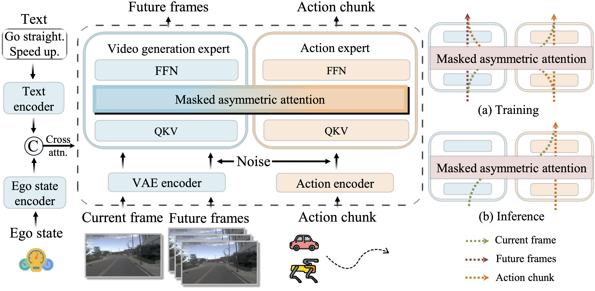
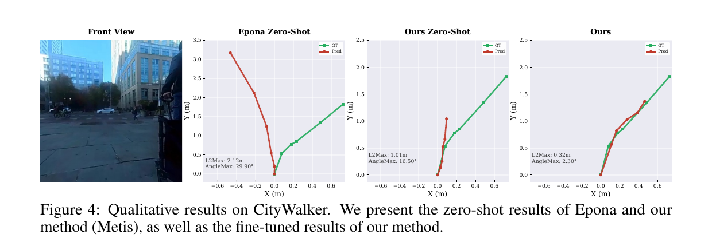
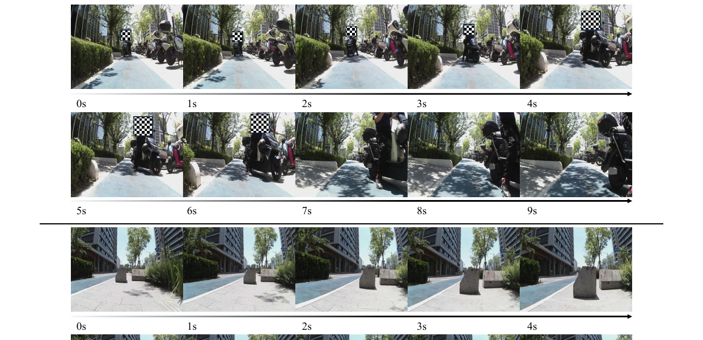

# Metis

<div align="center">

## Metis: A Generalizable and Efficient World-Action Model for Autonomous Driving and Urban Navigation

**Official implementation of Metis**

Jingyu Li<sup>1,2,&ast;</sup>, Zhe Liu<sup>3,&ast;</sup>, Dongnan Hu<sup>4,2</sup>, Junjie Wu<sup>5</sup>, Zipei Ma<sup>1,2</sup>, Wenxiao Wu<sup>6,2</sup>, Chao Han<sup>5</sup>, Zhihui Hao<sup>5</sup>, Zhikang Liu<sup>5</sup>, Kun Zhan<sup>5</sup>, Jiankang Deng<sup>7</sup>, Xiatian Zhu<sup>8</sup>, Li Zhang<sup>1,2,&dagger;</sup>

<sup>1</sup>Fudan University, <sup>2</sup>Shanghai Innovation Institute, <sup>3</sup>The University of Hong Kong, <sup>4</sup>Tongji University, <sup>5</sup>Li Auto Inc., <sup>6</sup>Huazhong University of Science and Technology, <sup>7</sup>Imperial College London, <sup>8</sup>University of Surrey

<sup>&ast;</sup>Equal contribution. <sup>&dagger;</sup>Corresponding author.

**Equal contribution:** Jingyu Li and Zhe Liu. **Corresponding author:** Li Zhang.

[](Metis.pdf)
[](#planned-release)
[](#model-zoo)
[](LICENSE)

</div>

<p align="center">
  
</p>

## News

- **2026.06.14**: Metis project page is live. Source code, pretrained checkpoints, and detailed documentation are planned for release in **August 2026**.

## Highlights

- **World-action modeling for both autonomous driving and urban navigation.** Metis is evaluated on NAVSIM-v2, NAVSIM-v1, CityWalker, and zero-shot real-robot deployment.
- **Joint training, decoupled inference.** Future video generation is used as a training signal, while inference directly predicts actions without explicitly generating future frames.
- **Mixture-of-Transformers architecture.** Metis separates a Video Generation Expert (VGE) and an Action Expert (AE), preserving the different distributions of visual generation and low-dimensional control.
- **Masked asymmetric attention.** Future video tokens can attend to future action tokens during training, while action tokens are masked from future video tokens and remain conditioned on the current observation, language instruction, and ego state. This lets the action branch benefit from world modeling without inheriting inference-time generation noise.
- **Efficient planning.** With 2 denoising steps on a single RTX 4090, action-only inference reaches **0.17s** with **89.2 EPDMS** on NAVSIM-v2 `navtest`, and is up to **8x faster** than explicit future-video inference in the reported setting.

## Overview

Metis is an end-to-end **World-Action Model (WAM)** for action planning in dynamic outdoor environments. Existing WAMs often require autoregressive future observation generation or tightly couple future video synthesis with action prediction. These designs introduce high latency and can pollute the action space with high-dimensional generation noise.

Metis addresses this with a simple principle:

> Learn future world dynamics during training, but do not generate future videos when planning at test time.

The model contains two specialized experts:

- **Video Generation Expert (VGE):** built from a pretrained video generation backbone, using a video VAE and text conditioning to model future scene dynamics.
- **Action Expert (AE):** a diffusion transformer branch for low-dimensional action chunk prediction.

During training, the two experts interact in a shared latent space under a **masked asymmetric attention** pattern. During inference, the video generation path is bypassed, so Metis predicts the action chunk from the current observation, instruction, and ego state in a low-latency forward denoising process.

## Method

### Problem Setting

Given a current visual observation `o_t`, language instruction `l`, and ego state, Metis predicts an action chunk `a_{t:t+H}`. In autonomous driving, each waypoint is represented as `(x, y, theta)`. In urban navigation, each waypoint is represented as `(x, y)`.

Future observations are used only as training supervision. At inference time, Metis performs:

```text
current observation + instruction + ego state -> action chunk
```

without sampling future video frames.

### Architecture

- **Backbone VGE:** Wan2.2-5B video generation expert in the main implementation setting.
- **Action branch:** approximately 1B parameters with hidden dimension `d_a = 1024`.
- **Total model size:** approximately 6B parameters.
- **Conditioning:** front-view image, text instruction, ego state.
- **Training objective:** joint flow matching loss for action prediction and future video generation.
- **Inference:** action-only denoising; the explicit future-video branch is skipped.

### Asymmetric Attention

Metis studies three interaction patterns between future video tokens and action tokens:

- **Joint attention:** future video and action tokens are fully coupled.
- **Isolated attention:** the two branches are completely separated.
- **Asymmetric attention (ours):** video tokens can attend to action tokens, but action tokens do not attend to future video tokens.

This asymmetric design keeps training and inference consistent: the action branch never depends on generated future frames, yet still receives useful gradients from the world modeling task during training.

## Benchmarks

- **NAVSIM-v2:** Metis is trained on `navtrain` with 1,192 scenarios and evaluated on `navhard` and `navtest`. `navhard` contains 244 safety-critical real-world scenarios in Stage 1 and 4,164 corresponding 3DGS-generated synthetic scenarios in Stage 2. `navtest` contains 12,146 real-world scenarios for generalization evaluation. The main metric is EPDMS.
- **NAVSIM-v1:** Metis is additionally evaluated on `navtest` with PDMS for comparison with prior planning methods.
- **CityWalker:** Metis is evaluated on 15 hours of teleoperation data from diverse urban areas in New York City, with 6 hours for fine-tuning and 9 hours for testing. The benchmark reports L2 distance and Maximum Average Orientation Error (MAOE).
- **Real-world navigation:** Metis is deployed zero-shot on a Unitree Go2 quadruped for indoor and outdoor closed-loop obstacle-avoidance tests.

## Main Results

### NAVSIM-v2 Navhard

Metis is evaluated on NAVSIM-v2 `navhard`, which includes Stage 1 real-world safety-critical scenarios and Stage 2 3DGS-generated synthetic counterparts.

| Method | Sensors | Stage 1 | Stage 2 | EPDMS |
| --- | --- | ---: | ---: | ---: |
| DiffusionDrive | 3xC+L | 66.7 | 40.5 | 27.5 |
| ReCogDrive | 1xC | 67.7 | 37.6 | 25.7 |
| SGDrive | 1xC | 71.1 | 35.2 | 25.5 |
| **Metis** | **1xC** | **75.8** | **41.7** | **32.2** |

### NAVSIM-v2 Navtest

Metis achieves state-of-the-art EPDMS among learning-based planners under the reported fair-comparison setting, using only the front camera and without multi-stage training, reinforcement learning, or auxiliary datasets.

| Method | Sensors | NC | DAC | EP | LK | EC | EPDMS |
| --- | --- | ---: | ---: | ---: | ---: | ---: | ---: |
| SGDrive | 1xC | 98.6 | 94.3 | 86.0 | 96.1 | 85.9 | 86.2 |
| Vega | 1xC | 98.9 | 95.3 | 87.0 | 96.1 | 76.3 | 86.9 |
| DriveFine | 1xC | 98.7 | 97.3 | 88.2 | 97.7 | 84.7 | 87.1 |
| Epona | 1xC | 97.1 | 95.7 | 88.6 | 97.0 | 67.8 | 85.1 |
| DriveVLA-W0 | 1xC | 98.5 | 99.1 | 86.4 | 93.2 | 58.9 | 86.1 |
| **Metis** | **1xC** | **98.4** | **97.2** | **87.8** | **97.8** | **88.0** | **89.5** |
| **Metis, best-of-6** | **1xC** | **98.5** | **97.5** | **87.9** | **98.0** | **90.0** | **90.3** |

### CityWalker

Metis is also evaluated for urban navigation on the CityWalker benchmark, using L2 distance and Maximum Average Orientation Error (MAOE). ABot-N0 is a pretrained method using large-scale navigation data and does not report L2; Metis achieves the best L2 and MAOE among the fine-tuned methods.

| Method | Setting | Mean L2 (m) | Mean MAOE (deg) | All L2 (m) | All MAOE (deg) |
| --- | --- | ---: | ---: | ---: | ---: |
| ABot-N0 | Pretrained | - | **11.2** | - | **7.6** |
| GNM | Fine-tuned | 1.22 | 16.2 | 0.74 | 12.1 |
| ViNT | Fine-tuned | 1.30 | 16.5 | 0.70 | 12.6 |
| NoMaD | Fine-tuned | 1.39 | 19.1 | 0.74 | 12.1 |
| CityWalker | Fine-tuned | 1.11 | 15.2 | 1.07 | 11.5 |
| **Metis** | **Fine-tuned** | **0.71** | 11.8 | **0.64** | 9.8 |

<p align="center">
  
  <br>
  <em>Qualitative comparison on CityWalker. Metis tracks the ground-truth trajectory far more closely than the zero-shot Epona baseline.</em>
</p>

### NAVSIM-v1 Navtest

| Method | Sensors | DAC | EP | PDMS |
| --- | --- | ---: | ---: | ---: |
| UniWorldVLA | 1xC | 96.7 | 83.2 | 89.4 |
| DriveLAW | 1xC | 97.1 | 81.3 | 89.1 |
| **Metis** | **1xC** | **97.1** | **83.4** | **89.1** |
| **Metis, best-of-6** | **1xC** | **97.5** | **84.0** | **89.7** |

## Efficiency

All latency numbers below are reported in the paper for single-GPU inference.

| Setting | Steps | navtest PDMS | navtest EPDMS | navhard EPDMS | RTX 4090 | H200 |
| --- | ---: | ---: | ---: | ---: | ---: | ---: |
| Action-only | 1 | 87.0 | 87.2 | 30.4 | 110 ms | 100 ms |
| Action-only | 2 | 88.9 | 89.2 | 31.2 | 147 ms | 140 ms |
| Action-only | 5 | 89.0 | 89.4 | 31.4 | 280 ms | 240 ms |
| Action-only | 10 | 89.1 | 89.5 | 32.2 | 480 ms | 430 ms |

Compared with explicit future-video inference:

| Method | PDMS | EPDMS | Latency |
| --- | ---: | ---: | ---: |
| Epona | 86.2 | 85.1 | 0.32s |
| PWM | 87.3 | - | 0.57s |
| PWM, with video | 88.1 | - | 0.83s |
| Metis, with video | 89.0 | 89.5 | 1.38s |
| **Metis, action-only (2 steps)** | **88.9** | **89.2** | **0.17s** |

## Ablations

### Attention Mask

| Image Size | Variant | navtest DAC | navtest LK | navtest EPDMS | navhard EPDMS |
| --- | --- | ---: | ---: | ---: | ---: |
| 320x384 | Joint | 96.5 | 97.0 | 87.4 | 28.0 |
| 320x384 | Isolated | 96.5 | 97.5 | 88.3 | 29.4 |
| 320x384 | **Asymmetric** | **97.0** | **97.6** | **88.8** | **31.6** |
| 640x768 | **Asymmetric** | **97.5** | **98.0** | **89.5** | **32.2** |

### Expert Capacity

The rows below reproduce the VGE/AE ablation labels reported in Table 6 of the paper.

| VGE | AE | navtest PDMS | navtest EPDMS | navhard EPDMS |
| --- | --- | ---: | ---: | ---: |
| Wan2.1-1.3B | ~0.24B | 88.5 | 88.8 | 28.8 |
| Wan2.2-14B | ~0.21B | 88.2 | 88.2 | 31.2 |
| Wan2.2-14B | ~1.04B | **89.1** | **89.5** | **32.2** |

### Co-training

| Training Paradigm | PDMS | EPDMS |
| --- | ---: | ---: |
| Without video co-training | 87.4 | 87.9 |
| With video co-training | **89.1** | **89.5** |

## Training Details

The paper reports the following experimental setup:

| Item | NAVSIM-v2 | CityWalker |
| --- | --- | --- |
| Input resolution | 640x768 | 384x384 |
| Action horizon | 8 waypoints, 4s, 0.5s interval | 5 waypoints |
| Action format | `(x, y, theta)` | `(x, y)` |
| Camera input | Front-facing camera only | Front-facing camera only |
| Training epochs | 60 | 30 |
| Batch size | 64 | 64 |
| Optimizer | AdamW | AdamW |
| Learning rate | `1e-4` | `1e-4` |
| Weight decay | `0.01` | `0.01` |
| Inference | 10 denoising steps, CFG = 1.0 | 10 denoising steps, CFG = 1.0 |
| Hardware | 8 NVIDIA H200 GPUs | 8 NVIDIA H200 GPUs |

## Real-World Deployment

Metis is deployed zero-shot on a Unitree Go2 quadruped for closed-loop obstacle avoidance. The reported real-world tests cover indoor daytime and outdoor nighttime environments. A PD controller adapted from prior navigation work converts predicted trajectories into velocity commands for the robot.

<p align="center">
  
  <br>
  <em>Zero-shot outdoor deployment (no task-specific training): the quadruped plans collision-free paths around a parked motorcycle and a rock over a 0–9s rollout.</em>
</p>

The public release will include additional deployment notes where possible.

## Planned Release

This repository is under active development. The full open-source release is planned for **August 2026**.

- [x] Paper PDF
- [x] Framework figure
- [ ] Inference code
- [ ] Training code
- [ ] Evaluation scripts
- [ ] NAVSIM-v2 data preparation guide
- [ ] CityWalker data preparation guide
- [ ] Pretrained checkpoints
- [ ] Documentation

## Model Zoo

| Model | Dataset | Input | Status |
| --- | --- | --- | --- |
| Metis-NAVSIM | NAVSIM-v2 / NAVSIM-v1 | 1x front camera, ego state, instruction | Coming in August 2026 |
| Metis-CityWalker | CityWalker | 1x front camera, ego state, instruction | Coming in August 2026 |

## Citation

If you find Metis useful for your research, please consider citing:

```bibtex
@misc{li2026metis,
  title        = {Metis: A Generalizable and Efficient World-Action Model for Autonomous Driving and Urban Navigation},
  author       = {Li, Jingyu and Liu, Zhe and Hu, Dongnan and Wu, Junjie and Ma, Zipei and Wu, Wenxiao and Han, Chao and Hao, Zhihui and Liu, Zhikang and Zhan, Kun and Deng, Jiankang and Zhu, Xiatian and Zhang, Li},
  year         = {2026},
  note         = {Preprint}
}
```

The citation entry will be updated after the paper receives an official arXiv or venue record.

## Acknowledgements

Metis builds on progress in video generation, world models, vision-language-action models, autonomous driving planning, and urban navigation. We thank the maintainers of the NAVSIM and CityWalker benchmarks, and the broader open-source robotics and autonomous driving communities.

## License

This project is released under the [Apache-2.0 License](LICENSE).
